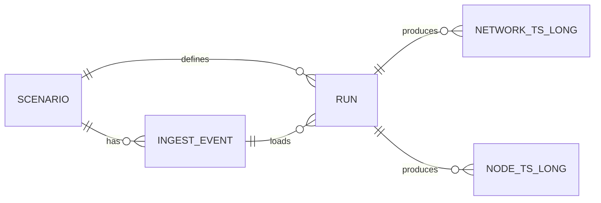
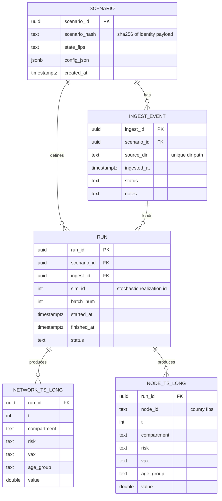

# Epidemic Surrogate Modeling
TACC PES code used to generate data for training surrogate models.

Database wire diagrams of proposed PostgreSQL DB to link with a CKAN public data portal (work in progress), so we don't need so many subdirs of input/output data.

